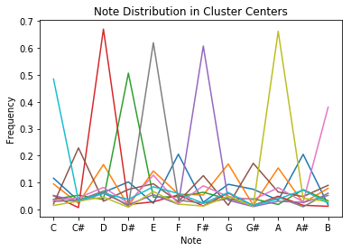
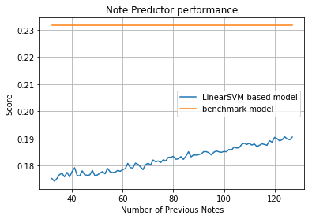

# Machine Learning Engineer Nanodegree
## Capstone Project
Thomas J. Webb  
January 19th, 2019

## I. Definition

### Project Overview
Machine learning techniques can be very useful in the domain of computer music and audio. Music theory is the study of the general rules music tends to follow and due to the vast knowledge provided by music theory, programmers are able to easily write software that analyzes or even generates music based on these known rules. However, music theory doesn't always encapsulate all that makes music sound pleasing to the ears. Successive generations of pop music will violate old rules and establish their own. By using machine learning, the computer can build a statistical model of what makes a given genre of music tick, perhaps even allowing the computer to discover things about the music the developers are unaware of.

This is not to say using music theory knowledge and using statistical techniques are mutually exclusive. Far from it. In machine learning, _domain knowledge_, information the developer has about the problem in question, can be used to improve the quality of the machine learning techniques. By striking a balance between being overly prejudiced with music theory while not completely avoiding the perks of music theory knowledge, we can make software that can make good predictions about the sorts of things one should expect in a modern composition.

Here, I look into a potential means of using machine learning to spot inaccuracies in inputs, which can be useful as part of a speech to virtual instrument pipeline, or to generate novel musical sequences. Other techniques have been used to this end. Hidden Markov Models (hmms) are a popular way of detecting an underlying state (chord progression) from a monophonic sequence (see [Harmonizing Pop Melodies using Hidden Markov Models](https://luckytoilet.wordpress.com/tag/hidden-markov-model/) and [Data-Driven Recomposition](https://www.cs.princeton.edu/sound/publications/hdphmm_icmc2008.pdf)). Google has also used RNNs to generate novel sequences (see [magenta](https://github.com/tensorflow/magenta/tree/master/magenta)). [This blog post](https://medium.com/cindicator/music-generation-with-neural-networks-gan-of-the-week-b66d01e28200) also details the use of C-RNN-GAN to create novel sequences from training data, along with some samples out output.

### Problem Statement
Predicting novel sequences from an existing sequence of notes serves two major purposes one may encounter when creating user-facing applications with music and audio capabilities, such as music making games:

1. The ability to detect and fix errors in a sequence, whether due to user error (note being off key) or error in pitch detection by the software itself
2. The ability to create novel sequences to accompany user input or to enhance the reusability of premade music sections

Since music is, like all art forms, intended to surprise and not simply be a repeat of rigid rules, some wiggle room should be allowed for accidentals and the most likely note shouldn't allways be the note that is selected in generation. An objective evaluation of whether the model does well enough on the test set can demonstrate that the model is learning _something_ that can be applies, while this analysis should ultimately be coupled with a subjective listening of computer-generated sequences.

Here we are treating this as a classification problem. By removing octave information from the equation, we are using environment data, including the recent history of notes to predict the next note. Additionally, we also treat the key and mode as a classification problem as well and use that input as part of the environment for the supervised learning problem, predicting the next note.

The strategy I propose is breaking it down into two parts. First, perform preprocessing to make the data usable by machine learning algorithms, ensure consistency, and remove data that isn't relevant. Second, perform an unsupervised learning algorithm on all of the tracks with melodic content in order to be able to classify tracks by their key and mode. Secondly, use that classification, the placement of the note within the measure it's in and a tunable number of previous notes as the dimensions of the label for a supervised learning technique.

### Metrics
Ultimately the best metric for evaluating these methods would be subjective. Have a number of musically-inclined people judge the output of the algorithm, whether corrected sequences or sequences with new notes added programmatically, based on how musically pleasing it is. However, that is beyond the scope of this since it requires a statistically appropriately large number of humans making these judgments. Before we can get to the point where it's worth doing such tests, it should clear a more objective test of accuracy first.

To this end, I split the data into a training set and a test set, and score based on how many predictions are correct. This output by itself doesn't tell us enough, however. It's simply a number between 0 and 1. A good baseline would be the simpler to implement benchmark, which is a function that guesses the following note by simply selecting a random note based on the distribution of probabilities in the composition. In other words, our model needs to do _better than chance_, with an educated understanding of the chance. Given the additional overhead of training a model, it should ideally do _significantly_ better than this benchmark to be worth the trouble.

The metric used to score both the SVM and the benchmark probabilistic model is mean accuracy. The notes are not treated as numerical, so there is no such thing as more or less wrong, only the one correct answer and the rest being incorrect. The basic formula is:

$score = \frac{number of correct predictions}{total number of predictions made}$  

## II. Analysis

### Data Exploration
Midi files are very simple and have been around for a long time. They are functionally like sheet music for software synthesizers (or could even with a midi interface be fed into hardware synthesizers). As they take up much less space than mp3 files they were a popular means of sharing music and embedding music in websites earlier in the internet's history. Tragically, with the cracking down on copyright violations and the rise of easy access to music on youtube and spotify, midi files have become harder to track down. Regardless, midi file collections remain one of the most convenient ways of quickly accessing large amounts of musical information with which to train models.

For this I propose using [this collection](https://www.reddit.com/r/WeAreTheMusicMakers/comments/3ajwe4/the_largest_midi_collection_on_the_internet/), though the code makes no assumption about which selection of midi files are being used. Simply drop midi files in the data directory and the code will crawl through and ingest any valid midi file it finds.

Midi files contain a collection of _tracks_, each track contains a sequence of midi _messages_. The midi file can contain metadata that applies to all the tracks such as tempo and key signature and time signature. Each message is the same kinds of midi messages that are passed between midi devices - information about notes being pressed, pitch bends, control changes and so on. For our purposes, we only look at note on and note off messages, combining the corresponding on and offs into note events. Each such note event has the following features:

- Start time
- End time
- Velocity
- Pitch (which we convert into two features - octave and note)

We also engineer an additional feature called measure position, which is the start time in terms of how long after the start of the measure it finds itself in. For example, if the song is in 4/4 time and the start time corresponds to the 6th quarter note in the song, then the measure position will be 2. Note that start time and end time is actually in ticks, not seconds, as is customary with midi applications. How many ticks are in a beat is also specified in the midi file.

In order to shorten training time, I zeroed in on a subset of the collection that focuses on rock hits one might find on the radio, to be found in the `data/Metal_Rock_rock.freemidis.net_MIDIRip` subfolder. Even with that restriction, it is still a hefty amount of data and still presents a challenge when trying to see the outcome of different tweaks being made. In the optimization step, I'd sometimes temporarily work with 100 or 1000-sized chunks of the data.

Drum tracks also must be excluded from the final report as they have a strong potential to throw off the data. Even though actual drums can be tuned to be in key, midi information for drums simply maps the notes to different drums, meaning they contain no actual melodic content. I looked at the names of the tracks (metadata that can be any arbitrary ascii string) and make sure to exclude tracks that contain the string "drum", case insensitive. However, as it's the job of the person composing the midi file to put accurate names on the tracks, this isn't a guarantee that there aren't actual drum tracks being processed as though they contained melodic data.

### Exploratory Visualization

The first step in giving the predictor data to work with is classifying the note sequences based on the relative frequencies of the different notes found in the piece. This is a crude way of hopefully getting at different keys and modes without having to code complicated music theory routines. For this, I used K Means clustering and the silhouette score to score the distinctiveness of the clusters. The highest silhouette score I achieved was by using 13 clusters but as you can see even then the score isn't very high. This doesn't mean that there are only 10 combinations of key and mode of course, but could simply reflect the data or the limitations of this technique.

A good way to visualize the quality of this technique is to look at the frequencies of the notes in the cluster centers. Do they look like recognizable keys and modes? If there is a peak at one note and you assume that's the root note, there should be another peak a fifth or seven semitones away (for example, the main peak at C should also have a smaller peak at G). There should also be a peak either 3 or 4 semitones away, depending on if it's minor or major, respectively. There are other modes but this pattern should at least be seen in most of the cluster centers. Looking at the teal line with a peak at C, we can see it also has a peak at E and G, as well as A# (the diminished 7th). So this corresponds to a C major scale, very common in nursery rhymes. The red line stands out with a peak at D, and smaller peaks at F, G and A. This looks like a D minor scale. Knowing this pattern, you can intuitively see that this looks like a bunch of different recognizable scales. Despite the silhouette score being poor, I'd say that this method at least correctly detected recognizable patterns I'd expect to see in the data.

### Algorithms and Techniques
I propose two models used in concert with each other in order to predict new notes. One, a clustering algorithm that clusters all melodies based on the relative frequencies of the 12 chromatic notes. Two, a supervised learning algorithm that predicts the next note based on its location, the cluster placement of the melody it's in, the beat (placement in time in the measure it's in) and the previous n notes (to be tuned) in the melody. The clusters likely would correspond to different modes and keys.

For clustering, we propose k means as a good way to determine key and mode. Such information can also be found in the key signature in the midi file, but it is not guaranteed to be present or accurate in a valid midi file. For classifying next note from previous notes, we propose using a linear support vector machine. It is a good algorithm for preventing overfitting and isn't too algorithmically complex for the huge dataset we're dealing with.

K Means creates a number of centroids, chosen at the start, placed randomly in the n-dimensional space, depending on the number of features. In our case, 12. Then all the points are assigned to a centroid based on the distance, then the centroids are pushed to the center of the points assigned to it. This is repeated until the centroids stop moving much or a preconfigured number of iterations has been reached. After this has run, we will hopefully have a number of centroids that represent something meaningful, key and mode combinations.

SVMs are a supervised learning algorithm that divides data into classes, by placing hyperplanes between them in n-dimensional space. Then the hyperplanes are moved until their margins to the data points are increased as much as possible or until the max number of generations is reached. To accomodate data that isn't linearly separable, a kernel is used that transforms the data into a higher dimension so that it is linearly separable. The flexibility in being able to use different kinds of kernels allows classifying data that isn't linearly separable or also choosing based on computational efficiency.

In our case, the large amount of data is difficult to accomodate with non-linear kernels so LinearSVC is used. The potentially large number of features (if a high number of previous notes are used) means SVMs are a good choice since they are less prone to over-fitting than other models.

We can tune the SVM by changing how many previous notes to look at, with the dimensionality being n+2. Higher number of previous notes gives the model more data to work with but also potentially could lead to overfitting (if you know a note from the previous 60 notes, you may simply be remembering a specific melody in a specific song). The clustering algorithm can be tuned by adjusting the number of clusters. In the previous exploration section, 10 appeared to be the optimal number of clusters, based on cluster distinctiveness.

### Benchmark
The benchmark model, which we hope to exceed in predictive quality, will be a simply probabilistic model. Get the probabilities of all the previous notes in a sequence and pick randomly based on that. For example, if there have been four notes already, A A C C, then pick A with a probability of 50% or C with a probability of 50%. Subsequent notes are picked in this manner but always based on the real previous notes, not the guesses.

We can then create a score based on these guesses and compare it to the scores of the final SVM model, comparing different values for previous notes to consider.

## III. Methodology

### Data Preprocessing
Data from out in the wild can be pretty wild. There are inconsistencies and as these aren't official but often made by music fans, they aren't necessarily accurate. The hope is that with a large enough quantity from a good collection, errors can be smoothed out. Polyphony is also a very complex thing and difficult to deal with without employing a lot of music theory like other approaches already tend to use. I wish to focus here just on monophonic sequences. All the valid musical sequences are used to train the clustering algorithm since only the note frequency data is used for that anyway. But the supervised learning will only be done on monophonic melodies. By only focusing on monophonic melodies, I can make some simplifying assumptions. The notes are sequences of values with features (note, octave, start and end positions). We also ignore any tracks that are labelled as drum track to hopefully avoid tracks without melodic content.

Before checking if melodies are monophonic or not and to be included in that set of data, I will quantize to some arbitrary precision. This reduces the dimensionality of the problem, though it will end up disqualifying many sequences from consideration (two 16th notes in a row will be quantized to the same position, making the sequence polyphonic even if it started out as monophonic). Now each note has an attribute of start position within the measure that is one of only x possibilities, with x being the precision. I'll start with 8th notes as that seems to strike a good balance.

Then for each monophonic sequences, I'll create an array of labels and data. The data is n+2 dimension, with n being the number of prior notes to look at:

1. The cluster classification of the sequences as a whole
2. The start position of the note in the measure it starts in (so 0-7 if we decided to quantize to 8th notes)
3. The previous n notes (note only, no octave, so 0-11)

The labels then are the note that followed those notes, one of 12 possible values. This means that we don't predict octave or rhythm. The techniques I'm using can easily be extended to include other variables, but I think it can be potentially more useful without that complexity and let the timing be dictated by user input or the much simpler music theory that governs rhythm.

To give one example to demonstrate the shape the data takes, imagine a note C3 that starts a 16th note after the beginning of the measure and followed two G2s in a row, where a previous notes value of 2 was chosen. Quantizing will push it to the beginning of the measure. Assuming the classifier assigned a cluster of id 3, we will have:

`[3, 0, 7, 7]`

These values are then normalized into floating point values due to the model's sensitivity to fluctuations in values.

### Implementation
First I train a K Means classifier on all melodic data, whether or not it is monophonic. I base the number of clusters on experimenting with which amount produces the most distinct clusters. Then I train an svm on this data, then evaluate it and benchmark it. Then I'll test to see if this does any better than the probabilistic model mentioned in the benchmark section.

I can tweak the parameters by hand to get better results, but it's also possible to loop through a range of possibilities in order to optimize the output. For example, I can select the best cluster number for the first classifier as [described here](https://scikit-learn.org/stable/auto_examples/cluster/plot_kmeans_silhouette_analysis.html). The graph in the exploratory visualizations section shows the outcome of this.

One of the biggest challenges with implementation is the turnaround time required to see how different tunable parameters affect the performance. It wasn't a real problem with K Means, which has a shorter training time, but was with the SVM model. To get around that, I worked with smaller subsets of the data, but even with smaller subsets, it was still time consumer. This shows the real practical importance of algorithms with better computational efficiency.

The positive from the implementation is now I have classes that quickly turn midi input data into forms easily digestible by machine learning algorithms. Regardless of the utility of the final model, that part of the code can save work for future explorations.

### Refinement
The following parameters can be tuned to affect the final results:

* Quantization precision to apply
* Number of previous notes to look at when training the supervised model (SVM)
* Number of cluster centers for the unsupervised classification model (K Means)
* SVM class weight

Quantization is a balancing act between several different concerns. Quantizing to lower precision means discarding more data and by pushing multiple notes that didn't overlap into overlapping, potentially discarding much more data as polyphonic sequences are left out of the training for the model. Quantizing to higher precision can increase the dimensionality of the data. I went with quantizing to eight notes.

The number of previous notes to look at gives the model more data to consider in making predictions but can lead to overfitting if the value is too high. I looped through different values for this parameter and comparing the scores. See the visualization in the conclusion section.

The number of cluster centers is important as this influences the quality of the classifier, which provides one of the values used by the SVM model. Too few clusters and songs in different modes are spuriously classified together, too many and we're unduly ignoring commonalities. I looped through different values for that and graphed the graph distinctiveness in the exploratory visualizations section.

The SVM itself can be adjusted in a number of ways. The class weight is one that appears most relevant to this application. By default, we're giving the model an undifferentiated sequence of floating point features. However, we could give the cluster assignment (key/mode) value additional weight, given how much information that one feature really gives us, compared to the previous note features. Conversely, using balanced mode can tell the algorithm to give a value more weight, the rarer it is.

## IV. Results

### Model Evaluation and Validation
The general pattern I see in playing around with parameters is the more data I look at, the higher the previous notes number needs to be. That is not very promising, because even if the scores on the test data climb up with higher values, I still intuitively feel like looking back more than a few notes is going to be overfitting. Then again, it could be that different songs reuse melodies from other songs more than I realize.

Regardless, the scores I get even with higher values for this parameter than I'm comfortable with are poor, and they're poorer than the score on the benchmark model. That leads me to think that, unless a drastic improvement is gotten by suggestions I make in the final section, improvement, this model isn't a good candidate for detecting bad notes or generating novel sequences.

The model does better than chance (which would be `1 / 12` or `.08`) but top out at less than `0.28`, worse than the educated chance of the probabilistic model. Since the probabilistic model is so simple and easy to implement in any language (no need for sklearn), I'd be inclined to choose that model for production even if the SVM did a little better. It needs to do _a lot_ better, and it simply isn't based on the scope of this exploration.

### Justification
The solution does better than random chance so it does give us some information, but since it doesn't do as well as the benchmark probabilistic model, it's simply not worth the trouble unless the improvements I outline in the final section are sufficient to give it a massive boost in performance. This could be because previous notes, current key and placement in measure aren't sufficient. It could also be because there were possible techniques to improve the performance of the algorithm I was unaware of. Either way, as the code currently stands, it is not good enough for production use.

## V. Conclusion

### Free-Form Visualization
Here we see the performance of the model with different values of previous notes. As we can see, increasing the value does increase the score, but even with sky-high number of features, it is still low. If the score is to be trusted, then the point of overfitting hasn't been reached.

### Reflection
While I'm calling this specific approach a negative result as it barely clears the performance of the benchmark model with very high number of features, I believe the components such as the midi pre-processing and the benchmark model provide a good starting point for evaluating other potential models for predicting notes (and thereby detecting bad notes and generating novel sequences). Writing code that processes midi is rather easy and I've done it many, many times before. But the classes found in the exploratory jupyter notebook make an easy starting point for further exploration without having to go through the tedium of parsing and converting data.

The unsupervised model, however, did seem to do a pretty good job without having to rely on complex music theory code. And that is something that can be useful and it's a machine learning technique that isn't so difficult to port to languages that don't already have a lib providing it. Indeed, detecting key and generating random notes in that key as the benchmark model does would be good enough for an arpeggiator built-in to a synthesizer or DAW (digital audio workstation). Often, simple is better.

### Improvement
Several potential areas of improvement present themselves:

__Quantization__
Currently, the model quantizes the notes first, then excludes tracks where any notes overlap from the final supervised model. This approach can be refined in order to improve the quality of the "position in measure" metric. It doesn't actually make sense to classify something a 16th note after the beginning of the measure as being on the on beat. If one wants to improve this technique, it would be worth discarding all notes that aren't sufficiently close to the quantization grid instead of moving them. This would allow many more tracks to be included as even some polyphonic tracks could even become monophonic, whereas the current algorithm is more likely to do the opposite.

__More Data__
What I lacked was time rather than data. By only looking at a subset of the wonderous collection of midi files I found, I may have missed out on a good antidote to overfitting, more data. If I'm not pressed for time, I could have a computer set to just work on training on all the available data, perhaps even over a range of one or two tunable parameters. By doing that, it may be possible to bring this from an unsatisfactory model to a good one.

__Cleaner Data__
Conversely, quality may matter more than quantity, if there are quality issues with the data. Ensuring that every single drum track is properly labelled as a drum track can help a lot. Also, curating a subset of the data that has accurate key signature data can be a good source to train a supervised model to detect modes with better accuracy than our unsupervised approach. Since many of the files do in fact have this data, I may be missing out by ignoring it completely.

Lastly, having someone listen to the files using a midi player can help identify and remove or fix any files for which the data is simply inaccurate. Since these files aren't from official sources but made by fans, it can have the same kinds of inaccuracies that, for example, guitar tabs on the internet might have. Removing inaccurate data can certainly improve the quality of the model, although the errors tend to be musical so it might not make the biggest difference.
